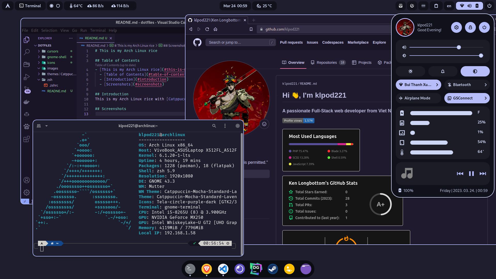

## Table of Contents

- [Table of Contents](#table-of-contents)
- [Introduction](#introduction)
- [Screenshots](#screenshots)
- [Installation](#installation)
- [Thanks](#thanks)

## Introduction

This is my Arch Linux Rice with [Catppuccin](https://catppuccin.com/)

## Screenshots



## Installation

1. Install [Arch Linux](https://www.archlinux.org/) and [Gnome](https://www.gnome.org/) as desktop environment.
2. Copy the files from the [themes](themes) folder to `~/.themes/` and the files from the [icons](icons) folder to `~/.icons/`.
3. Copy folder [gtk-4.0](themes/Catppuccin-Mocha-Standard-Lavender-Dark/gtk-4.0) to `~/.config/`.
4. Copy the files from the [cursors](cursors) folder to `~/.icons/`.
5. Set the theme and icons in Gnome Tweak Tool.
6. Install zsh with:

   ```pacman -S zsh```
7. Install [oh-my-zsh](https://ohmyz.sh/) with:

   ```sh -c "$(curl -fsSL https://raw.github.com/ohmyzsh/ohmyzsh/master/tools/install.sh)"```
8. Install [powerlevel10k](https://github.com/romkatv/powerlevel10k) by follow the [installation guide](https://github.com/romkatv/powerlevel10k#oh-my-zsh).
9.  Make a backup of your `.zshrc` file and copy the [.zshrc](.zshrc) file from this repository to your home directory.
10. Install [zsh-syntax-highlighting](https://github.com/zsh-users/zsh-syntax-highlighting) with:
    
    ```git clone https://github.com/zsh-users/zsh-syntax-highlighting.git ${ZSH_CUSTOM:-~/.oh-my-zsh/custom}/plugins/zsh-syntax-highlighting```
11. Install [zsh-autosuggestions](https://github.com/zsh-users/zsh-autosuggestions) with:
    
    ```git clone https://github.com/zsh-users/zsh-autosuggestions ${ZSH_CUSTOM:-~/.oh-my-zsh/custom}/plugins/zsh-autosuggestions```
12. Copy the (extensions)[gnome-shell/extensions] folder to `~/.local/share/gnome-shell/extensions/` and enable the extensions in Gnome Extensions.
13. Copy the [dconf](gnome-shell/dconf) file to `~/.config/dconf/` and run `dconf load / < dconf` to load the settings.
14. Restart Gnome with `Alt + F2` and type `r` and press `Enter`.

## Thanks

- [Catppuccin](https://catppuccin.com/)
- [Gnome](https://www.gnome.org/)
- [Gnome Extensions](https://extensions.gnome.org/) and all authors of the extensions I use [here](gnome-shell/extensions)
- [Arch Linux](https://www.archlinux.org/)
- [oh-my-zsh](https://ohmyz.sh/)
- [powerlevel10k](https://github.com/romkatv/powerlevel10k)
